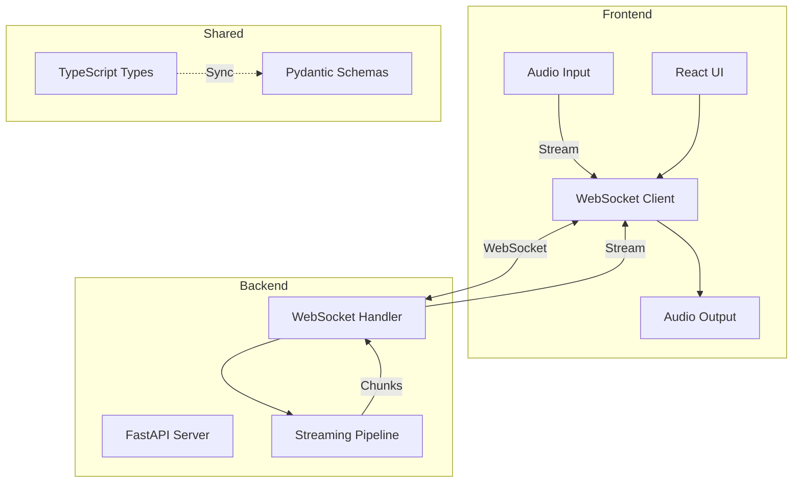

# Mini Jarvis 🎙️

A low-latency, voice-first assistant built with streaming architecture.

## 🏗️ Architecture Overview



## 📁 Monorepo Structure

```
mini-jarvis/
├── frontend/              # React + Vite + TypeScript
│   ├── src/
│   │   ├── components/   # UI components
│   │   ├── hooks/        # Custom React hooks
│   │   ├── services/     # WebSocket & API clients
│   │   └── types/        # Frontend-specific types
│   ├── package.json
│   ├── tsconfig.json
│   └── vite.config.ts
│
├── backend/               # FastAPI + Python
│   ├── app/
│   │   ├── api/          # REST & WebSocket routes
│   │   ├── services/     # Business logic
│   │   ├── config.py     # Settings
│   │   └── main.py       # Entry point
│   ├── tests/
│   └── pyproject.toml
│
├── shared/                # Type-safe contracts
│   ├── typescript/       # TS types for frontend
│   └── python/           # Pydantic schemas for backend
│
├── package.json          # Root workspace config
└── README.md             # This file
```

## 🎯 Core Principles

### 1. Voice-First Design
- **Primary interaction**: Voice input/output
- **Low latency**: Optimized for real-time conversation
- **Streaming**: All data flows as streams, not batches

### 2. Clean Separation of Concerns

#### Frontend Responsibilities
- Audio capture and playback
- WebSocket connection management
- UI state and user feedback
- Client-side audio processing

#### Backend Responsibilities
- WebSocket message routing
- Stream orchestration
- Response generation (placeholder for now)
- Error handling and recovery

#### Shared Responsibilities
- Type definitions (TypeScript ↔ Python)
- Message schemas
- Protocol contracts

### 3. Streaming Everywhere

All data flows are **streaming** by default:

- **Audio In**: Continuous chunks from user microphone
- **Audio Out**: Chunked audio playback
- **Text**: Token-by-token streaming (when implemented)
- **Events**: Real-time status updates

## 🔄 Data Flow

### WebSocket Message Protocol

All messages follow a common schema (see `shared/`):

```typescript
{
  type: MessageType,      // audio_chunk | text_chunk | start_stream | end_stream | error
  timestamp: string,      // ISO 8601
  // ... type-specific fields
}
```

### Message Types

| Type | Direction | Purpose |
|------|-----------|---------|
| `audio_chunk` | Client → Server | Streaming audio input |
| `text_chunk` | Server → Client | Streaming text response |
| `start_stream` | Both | Begin new stream |
| `end_stream` | Both | Terminate stream |
| `error` | Both | Error information |

## 🚀 Quick Start

### Prerequisites

- **Node.js** ≥ 18.0.0
- **Python** ≥ 3.10
- **npm** ≥ 9.0.0

### Installation

```bash
# Install all dependencies
npm run install:all
```

### Development

Run both frontend and backend concurrently:

```bash
npm run dev
```

Or run individually:

```bash
# Frontend only (port 5173)
npm run dev:frontend

# Backend only (port 8000)
npm run dev:backend
```

### Access Points

- **Frontend**: http://localhost:5173
- **Backend API**: http://localhost:8000
- **API Docs**: http://localhost:8000/docs

## 🧪 Testing

```bash
# Frontend tests (when implemented)
cd frontend && npm test

# Backend tests (when implemented)
cd backend && pytest
```

## 📝 Development Guidelines

### Adding New Features

1. **Define types first** in `shared/`
   - Add TypeScript interface in `shared/typescript/`
   - Add matching Pydantic model in `shared/python/`
   
2. **Backend implementation**
   - Add service logic in `backend/app/services/`
   - Add API routes in `backend/app/api/`
   - Write tests in `backend/tests/`

3. **Frontend implementation**
   - Add service client in `frontend/src/services/`
   - Create UI components in `frontend/src/components/`
   - Add hooks in `frontend/src/hooks/`

### Type Safety

- **Frontend**: TypeScript strict mode enabled
- **Backend**: Pydantic for runtime validation
- **Shared**: Keep TS and Python schemas in sync

### Code Style

- **Frontend**: ESLint + Prettier
- **Backend**: Black + Ruff
- **Commits**: Conventional commits recommended

## 🎨 Tech Stack

### Frontend
- **React 18** - UI framework
- **TypeScript** - Type safety
- **Vite** - Build tool and dev server

### Backend
- **FastAPI** - Async web framework
- **Pydantic** - Data validation
- **Uvicorn** - ASGI server
- **WebSockets** - Real-time communication

### Shared
- **TypeScript** - Frontend types
- **Pydantic** - Backend schemas

## 🔮 Future Roadmap

### Phase 1: Core Streaming ✅ (Current)
- [x] Monorepo structure
- [x] WebSocket protocol definition
- [ ] Audio streaming implementation
- [ ] Basic voice activity detection

### Phase 2: Intelligence
- [ ] LLM integration
- [ ] Streaming text-to-speech
- [ ] Streaming speech-to-text

### Phase 3: Memory & Context
- [ ] Conversation history
- [ ] Context management
- [ ] Session persistence

### Phase 4: Tools & Actions
- [ ] Function calling
- [ ] External integrations
- [ ] Action execution

## 📄 License

MIT

---

**Status**: 🏗️ Foundation complete - Ready for implementation
